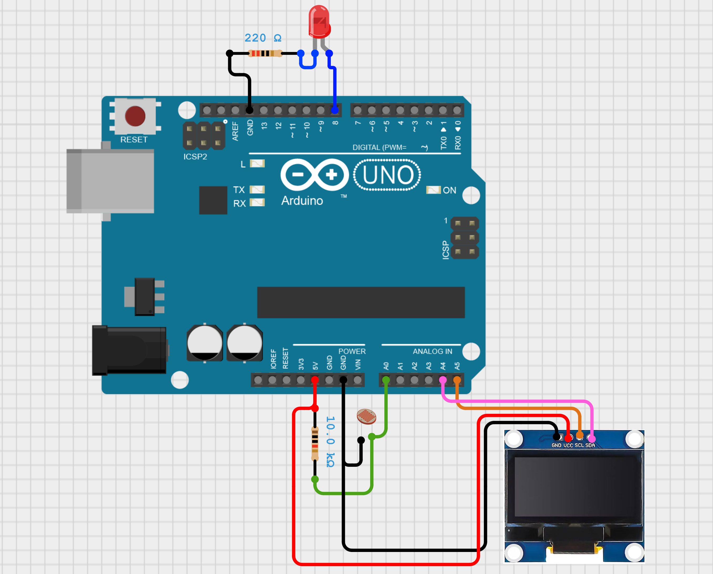

# Sensor-Actuator-Integration-Arduino

This repository contains documentation of the **Task 1: Sensor–Actuator Integration (Arduino)** for **Arduino Winter Internship 2025** at FOSSEE, IIT Bombay.

## Overview
The goal of this task is to  build a simple real-time system that monitors an analog sensor and triggers an actuator based on a threshold.

## Components Used
- Arduino Uno
- Light Dependent Resistor (LDR) - Analog Sensor
- LED - Actuator
- 10k Ohm Resistor
- 220 Ohm Resistor
- SSD1306 I2C OLED Display (for displaying sensor values)
- Breadboard and Jumper Wires

## Circuit Diagram
The circuit diagram for this task is:
<p>
	
</p>

## Functionality Overview
1. The Arduino code reads the analog value from the LDR sensor, compares it with the threshold value = `700`.
    - If the sensor value exceeds the threshold: The LED is turned `ON` 
    - If the sensor value does not exceed the threshold: The LED is turned `OFF`

2. It also displays the sensor value on the **Serial Monitor** and **OLED display**.

3. The analog value varies from `100` to `500` in bright light conditions and from `800` to `1000` in dark conditions.

## Code Explanation
1. The following libraries are included:
   ```cpp
   #include <Wire.h>
   #include <Adafruit_GFX.h>
   #include <Adafruit_SSD1306.h>
   ```
2. The following macros are defined:
   ```cpp
    #define SCREEN_WIDTH 128     // Width of OLED display in pixels
    #define SCREEN_HEIGHT 64     // Height of OLED display in pixels

    #define LED_PIN 8            // Pin connected to LED
    #define LDR_PIN A0           // Analog pin connected to LDR
    ```
3. An instance of the OLED display is created:
   ```cpp
    Adafruit_SSD1306 display(SCREEN_WIDTH, SCREEN_HEIGHT);
    ```
4. A variable to store the sensor value is defined:
    ```cpp
    int reading;
    ```
5. In the `setup()` function:
    - The LED pin is set as an output and LDR pin as input.
        ```cpp
        pinMode(LED_PIN, OUTPUT);
        pinMode(LDR_PIN, INPUT);
        ```
    - The Serial Monitor is initialized at a baud rate of `9600`.
        ```cpp
        Serial.begin(9600);
        ```
    - The OLED display is initialized.
        ```cpp
        if(!display.begin(SSD1306_SWITCHCAPVCC, 0x3C)) {
            Serial.println(F("SSD1306 allocation failed")); // Print error if display not found
            for(;;); // Infinite loop to stop code execution if display fails to initialize
        }
        ```
6. In the `loop()` function:
    - The analog value from the LDR is read and stored in the `reading` variable.
        ```cpp
        reading = analogRead(LDR_PIN);
        ```
    - The sensor value is printed to the Serial Monitor.
        ```cpp
        Serial.print("Reading: ");
        Serial.println(reading);
        ```
    - The LED state is updated based on the value of `reading`.
        ```cpp
        if (reading > 700) {
            digitalWrite(LED_PIN, HIGH); 
        } else {
            digitalWrite(LED_PIN, LOW); 
        }
        ```
    - The OLED display is updated to show the current sensor value.
        ```cpp
        display.clearDisplay();
        display.setTextSize(2);
        display.setTextColor(WHITE);
        display.setCursor(0, 0);
        display.println("Reading:");
        display.setCursor(40, 30);
        display.setTextSize(3);
        display.println(reading);
        display.display();
        ```
    - A delay of `200 milliseconds` is added before the next loop iteration.
        ```cpp
        delay(200);
        ```
## Video Demonstration
The video [demonstaration.mp4](demonstration.mp4) shows the working of this project.
